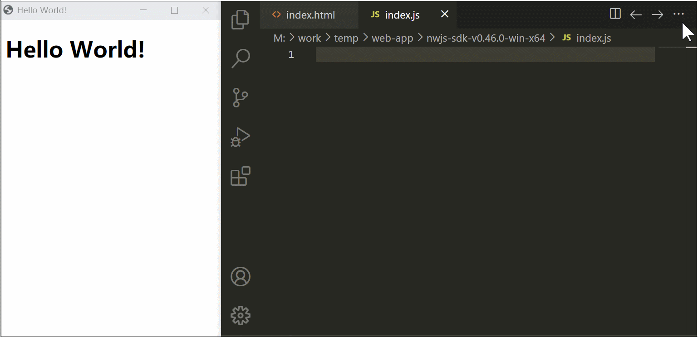

# VS Code NW.js snippets

This extension contains code snippets for NW.js for Vs Code editor.

## Installation

In order to install an extension you need to launch the Command Palette (Ctrl + Shift + P or Cmd + Shift + P) and type Extensions. There you have either the option to show the already installed snippets or install new ones. Search for *NW.js snippets* and install it.

## Snippets

All snippets are start with `nw`:
- `nw.`: Official API
- `nw-`: Some useful code snippets

### `nw.`
| Trigger | API |
| ------- | ------- |
| `nwa`   | `nw.App.*` |
| `nwc`   | `nw.Clipboard.*` |
| `nwm`   | `nw.Menu.*` |
| `nws`   | `nw.Screen.*` |
| `nwshe` | `nw.Shell.*` |
| `nwsho` | `nw.Shortcut.*` |
| `nwt`   | `nw.Tray.*` |
| `nww`   | `nw.webview.*` |
| `nwwi`  | `nw.Window.*` |

### `nw-`

| Prefix | Snippet Description |
| ------- | ------- |
| `nw-menubar` | Create a menubar |
| `nw-contextmenu` | Create a contextmenu |
| `nw-tray` | Create a tray |
| `nw-globalHotKey` | Register global hot key |
| `nw-liveReload` | Live reload current window |
| `nw-liveReloadApp` | Live reload app |
| `nw-openBrowser` | Open default browser |
| `nw-openFile` | Open file |
| `nw-openFileManager` | Open file manager |
| `nw-openWindow` | Open new window |
| `nw-relaunchApp` | Relaunch app |
| `nw-getCurrentScreen` | Get current screen |
| `nw-hideWindowInsteadOfClose` | Hide window instead of close |

## Note

- About `nw.win.cookies`, see  [chrome.cookies](https://developer.chrome.com/docs/extensions/reference/cookies/).